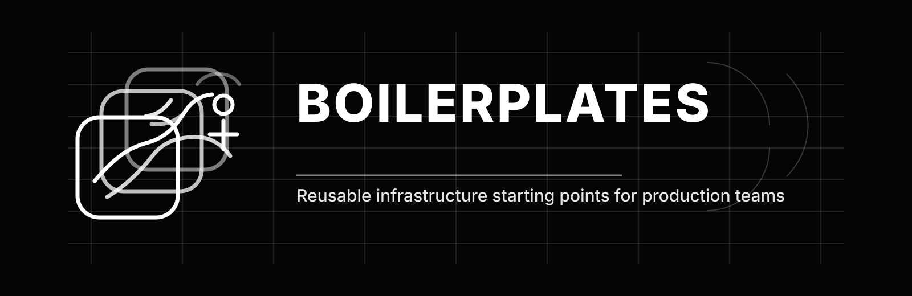

<<<<<<< HEAD
<div align="center" style="">

<h1 align="center">🚀 Production-Ready Docker, Kubernetes Boilerplates</h1>
=======
<div align="center">
  
</div>

<h1 align="center">Production-Ready Infrastructure Boilerplates</h1>
>>>>>>> 91ec0708497a50bd48dba552fe4970c11186f332

<p align="center">
  Reusable templates for Docker, Kubernetes, Ansible, Terraform/OpenTofu, and related infra tooling.
</p>
</div>

<<<<<<< HEAD
Hi there, I'm victor3spoir, I'm DevSecOps Practionner & Tech enthousiast, I like writting technicals writes & sharing knowledges.
  
Here, you will find a collections of production ready templates & config files for technologies & tools I have personnaly tested & use in my daily work. I hope you will find here something that can help you.
  
## 🚀 Getting Started

### Docker
=======
<p align="center">
  <a href="https://github.com/victor3spoir/boilerplates/stargazers"></a>
  <a href="https://github.com/victor3spoir/boilerplates/commits"></a>
  <a href="https://github.com/victor3spoir/boilerplates/issues"></a>
  <a href="./LICENCE"></a>
</p>

<p align="center">
  
  
  
  
  
</p>

I'm Victor, a DevSecOps practitioner and technical writer. This repository collects infrastructure boilerplates I use, test, and reuse in real work.
>>>>>>> 91ec0708497a50bd48dba552fe4970c11186f332

The goal is simple: keep production-ready starting points for common infrastructure tasks in one place, so the hard parts are already wired and the remaining work is project-specific.

<<<<<<< HEAD
```bash
# Create a copy of the service.env config file
cp service.env .env

# Launch the application
docker-compose -f compose.yml up -d
```
=======
## What's inside

- `docker-compose/`: categorized Compose stacks for databases, brokers, identity (`iam`), observability, monitoring, analytics, firewalls, storage, vault, CMS, media, automation, AI (`ia`), SMTP, registries, dashboards, and service examples.
- `docker/`: shared Dockerfiles, bake definitions, and framework-specific images (Next.js, TanStack).
- `kubernetes/`: reusable manifests for base objects such as `Deployment`, `Service`, `Ingress`, `PVC`, `PV`, `Secret`, `DaemonSet`, and `StatefulSet`, plus app-specific examples like Traefik, PostgreSQL, MongoDB, and Nextcloud.
- `ansible/`: playbooks, inventory, and build files for provisioning hosts and automating repeatable system setup.
- `terraform-tofu/`: Terraform/OpenTofu examples.
- `gitlab/`: GitLab CI templates and reusable CI/CD components.
- `cloud-config/`: cloud-init bootstrap configuration.
- `devcontainers/`: ready-to-use development container setups (.NET, Frappe, Python, web).

## Purpose

This is not a single application repository. It is a library of self-contained starting points you can copy, adapt, and combine.

Most folders include:
>>>>>>> 91ec0708497a50bd48dba552fe4970c11186f332

- configuration files close to the service they configure
- environment files or config samples where needed
- deployment examples for local, staging, or infrastructure use
- defaults that are intentionally easy to override

<<<<<<< HEAD
For Kubernetes deployments

```bash
kubectl apply -f /path/to/config.yml
```
=======
## Contributing

Contributions are welcome when they improve clarity, correctness, or usability.
>>>>>>> 91ec0708497a50bd48dba552fe4970c11186f332

Before opening a pull request:

- keep changes focused on one boilerplate or one improvement
- prefer production-oriented defaults over opinionated extras
- make sure file paths, environment variables, and references are consistent
- update related docs when behavior changes

If you want to add a new boilerplate, keep the folder structure predictable and mirror the style already used in the repository.

## Notes

- The repository is organized by technology and use case, not by application framework.
- Configuration files are intentionally kept close to their service definitions so they can be copied, overridden, or adapted quickly.
- Many examples include default values, placeholder credentials, or staging settings that should be changed before production use.

## Feedback

If you find a broken config, a missing example, or a clearer way to structure a boilerplate, open an issue or send feedback.

## Contact

Write me at [victorespoir.dev@gmail.com](mailto:victorespoir.dev@gmail.com) if you want to suggest a missing category, request a structure cleanup, or discuss a boilerplate pattern.

## License

Released under the BSD Zero-Clause License (0BSD) — copy, adapt, and reuse freely with no attribution required. See [LICENCE](./LICENCE) for details.
