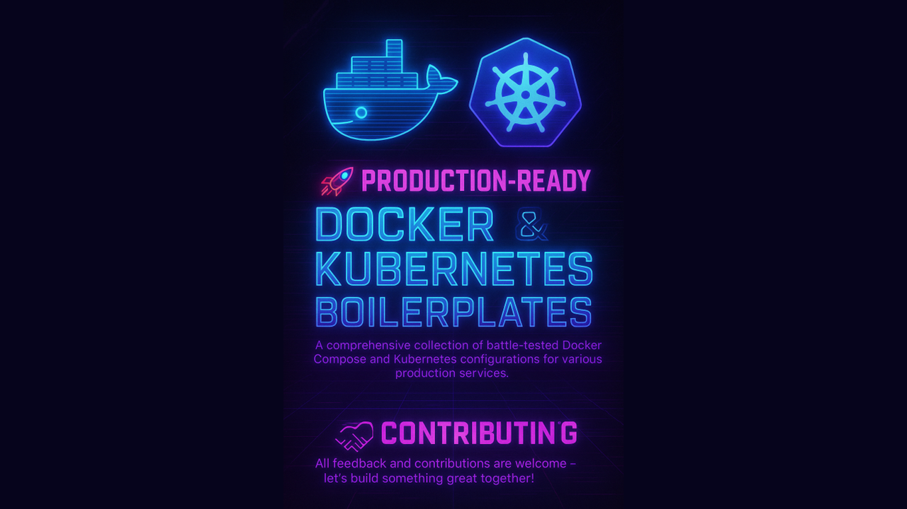

<div align="center" style="">
 
</div>

<h1 align="center">🚀 Production-Ready Docker & Kubernetes Boilerplates</h1>

<p align="center">
  
  
  
</p>

<div align="center">
  A comprehensive collection of battle-tested Docker Compose and Kubernetes configurations for various production services.
  <br/>
  These configs are thoses I use in my everyday works for my deployments. I hope you'll will find something helpfull.
</div>

<br>

## 🚀 Getting Started

```bash
# For Docker deployments
docker-compose up -d

# For Kubernetes deployments
kubectl apply -f /path/to/config.yml
```

## 📦 Services categories

- 🤖 Automation Tools
- 🌐 CMS
- 🔒 Security
- 👤 dentity Providers
- 🌐 Services
